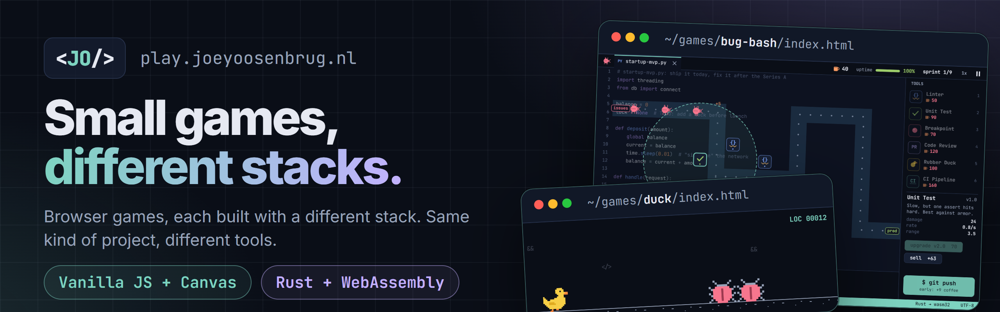

# Play



A hub of small browser games at [arcade.joeyoosenbrug.nl](https://arcade.joeyoosenbrug.nl), each built with a different frontend stack. It is a personal playground: the same kind of small project in different frameworks, to feel how they compare.

The hub looks like the rest of [joeyoosenbrug.nl](https://joeyoosenbrug.nl): it uses the portfolio's [design kit](https://github.com/joeykwispel/Portfolio/tree/main/docs/design-kit) (tokens, header, cards), English at `/` and Dutch at `/nl/`.

| Game                    | Stack                     | Build tool        | Folder                         |
| ----------------------- | ------------------------- | ----------------- | ------------------------------ |
| Rubber Duck Run         | Vanilla JS + Canvas       | esbuild           | `games/duck/`                  |
| Bug Bash                | Rust + WebAssembly        | cargo + esbuild   | `games/bug-bash/`              |
| Git Gud                 | React + TypeScript        | Vite              | `games/git-gud/`               |
| Standup Survivor        | Kotlin/JS                 | Gradle            | `games/standup-survivor/`      |
| Infinite Scroll         | ReScript + Three.js       | ReScript + Vite   | `games/infinite-scroll/`       |
| Deploy Tycoon           | Elm                       | elm make + Vite   | `games/deploy-tycoon/`         |
| Semicolon Snake         | Lua (Fengari)             | Vite              | `games/semicolon-snake/`       |
| Dependency Hell         | C++ + Box2D               | Emscripten + Vite | `games/dependency-hell/`       |
| Dev-Ware                | Gleam + Lustre            | gleam + Vite      | `games/dev-ware/`              |
| Cookie Consent Speedrun | HTML + CSS only           | no JavaScript     | `games/cookie-consent/`        |
| Code Review Tinder      | Dart + Flutter            | flutter build web | `games/code-review-tinder/`    |
| rm -rf dungeon          | Python (Pyodide)          | Pyodide + Vite    | `games/rm-rf-dungeon/`         |
| Localhost Golf          | Godot (GDScript)          | Godot web export  | `games/localhost-golf/`        |
| Merge Conflict Tetris   | Go (TinyGo → WebAssembly) | TinyGo + Vite     | `games/merge-conflict-tetris/` |
| Regex Golf Range        | Ruby (ruby.wasm)          | ruby.wasm + Vite  | `games/regex-golf/`            |

Building Bug Bash needs Rust with the WebAssembly target: install [rustup](https://rustup.rs), then `rustup target add wasm32-unknown-unknown`. Standup Survivor needs a JDK 21 (`JAVA_HOME`); Gradle itself comes with the wrapper. Dependency Hell needs [Emscripten](https://emscripten.org) (`emcc` on the PATH, e.g. via emsdk); its build fetches Box2D itself. Dev-Ware needs [Gleam](https://gleam.run) (`gleam` on the PATH; it fetches Lustre itself); on Windows, turn on Developer Mode so Gleam can create symbolic links. Code Review Tinder needs [Flutter](https://flutter.dev) 3.47 (`flutter` on the PATH). rm -rf dungeon runs its tests with Python 3 (`python3` or `python`); in the browser, Pyodide comes from npm. Localhost Golf needs [Godot](https://godotengine.org) 4.7.2 and its `web_nothreads_release.zip` export template: set `GODOT` to the binary and `GODOT_TEMPLATES` to the folder with the template, if they aren’t in the default places. Merge Conflict Tetris needs [Go](https://go.dev) 1.27 for its tests, and [TinyGo](https://tinygo.org) 0.42 with Binaryen's `wasm-opt` on the PATH to build. Regex Golf Range needs nothing extra: Ruby comes from npm as ruby.wasm, and its tests run in Node. Bug Bash has no crates and no wasm-bindgen: the Rust code exports plain functions and leaves a draw list in memory, and `web/main.js` replays it on a canvas.

## How it fits together

```
games.json            the only list of games: slug, title, description, framework, thumbnail
src/                  the hub (SvelteKit, static). Just a shell: header, grid, /play/<slug>/ page, footer
static/thumbs/        card icons (one-color SVGs, tinted with the brand gradient)
games/<slug>/         one fully independent app per game: own package.json, own bundler, own tests
scripts/build.mjs     builds the hub into dist/, then every game, and copies each to dist/games/<slug>/
```

- **The hub is only a shell.** `/play/<slug>/` shows the game in an `<iframe>` pointing at `/games/<slug>/`, inside the site's header, with a back link.
- **Games share nothing** with the hub or with each other: no shared bundle, no shared dependencies. Each builds to its own static folder with relative paths.
- **Hub → game messages are optional.** The hub adds `?lang=en|nl` to the iframe URL and sends `{ type: 'play:settings', lang, theme }` with `postMessage` on load and when the theme changes (see `src/lib/messages.ts`). A game must also work on its own page without them.

## Commands

| Command               | What it does                                                                     |
| --------------------- | -------------------------------------------------------------------------------- |
| `npm run dev`         | Hub dev server. Games are served from their last build (`npm run build:games`)   |
| `npm run build`       | Hub + all games into `dist/`, ready for GitHub Pages                             |
| `npm run build:games` | Installs and builds every game in its own folder                                 |
| `npm run preview`     | Serves `dist/` like GitHub Pages does, on port 4173 (`-- --port 4180` to change) |
| `npm run check`       | Type check (svelte-check)                                                        |
| `npm run lint`        | Prettier + ESLint                                                                |
| `npm run test:unit`   | Hub unit tests (Vitest), including a check of every `games.json` entry           |
| `npm run test:games`  | Each game's own tests                                                            |
| `npm run og`          | Share images (`static/og/`) and the README banner, from screenshots of the build |
| `npm run test:e2e`    | Playwright + axe on the build (`PW_CHANNEL=chrome` uses your installed Chrome)   |

Inside a game folder, `npm run dev` / `npm run build` / `npm test` work on that game alone.

## Adding a game

1. Create `games/<slug>/` as its own project with any framework and bundler (Vite + React, Vue, Solid, Angular, …).
   - `npm run build` must output a static site to `games/<slug>/dist/` (or set `outDir` in `games.json`).
   - Use **relative asset paths** (Vite: `base: './'`), because the game is served from `/games/<slug>/`.
   - Optionally read `?lang=` and listen for the `play:settings` message.
   - A game without JavaScript sets `"noScript": true`: it gets a page per language (`index.html`, `nl/index.html`) and the theme as `#light` or `#dark` in its URL, for CSS `:target` (see Cookie Consent Speedrun).
2. Add a thumbnail to `static/thumbs/<slug>.svg` (one color; the hub tints it).
3. Add one entry to `games.json`, a scene for it in `scripts/og.mjs`, and run `npm run build && npm run og` for its share image.
4. Add a Dependabot entry for `/games/<slug>` in `.github/dependabot.yml`.

`npm run test:unit` fails if the entry is incomplete, the thumbnail is missing or the game has no build script.

## Deploy

Merging a pull request into `master` runs `.github/workflows/deploy.yml`, which builds everything and publishes `dist/` to GitHub Pages. One-time setup: Settings → Pages → Source: GitHub Actions, custom domain `arcade.joeyoosenbrug.nl` (the `CNAME` file is in `static/`), and a DNS CNAME record for `arcade` pointing at `joeykwispel.github.io`.
